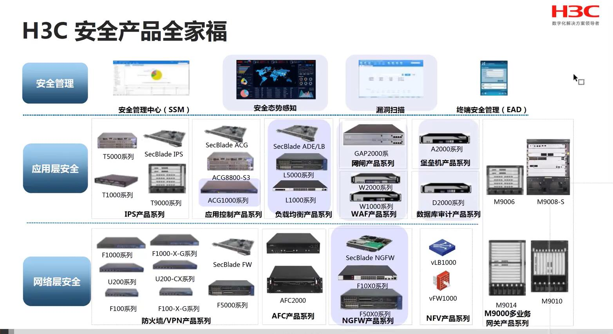
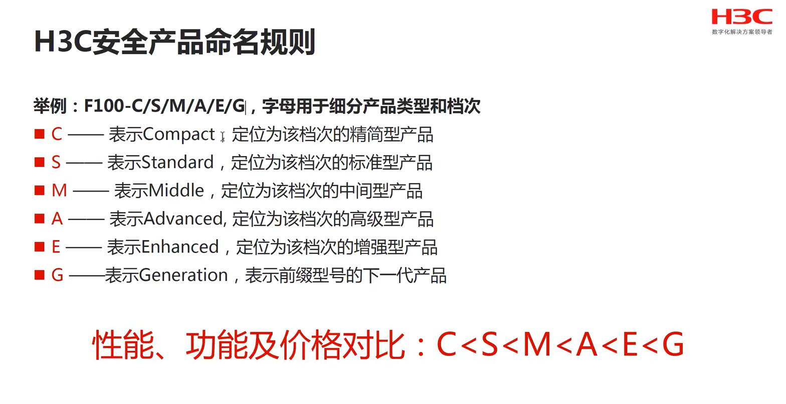

# 企业级网络安全与等保2.0
### 1、网络安全部门
```
- 公安部
 - 网络安全保卫局(网安)
 - 技侦、刑侦、经侦
 - 下属单位
  - 公安部一所、三所
  - 中电30所
  - 信息安全评测认证中心
   - 国家信息安全漏洞库
- 网信办
 - CNCERT国家互联网应急中心(原来在工信部)
 - CNNIC中国互联网络信息中心(原来在工信部)
 - 国家计算机网络与信息安全管理中心(原来在工信部)
- 工信部
 - 网络安全管理局
 - 通管局、无委会
- 国安
 - 南京841研究所
- 军队(密级高、点到即止)
 - 56所 无锡江南所
 - 30所 卫士通
- 机要和保密局
 - 国家保密局保密科技评测中心
```
## 一、网络安全概述
## 二、网络安全大事件
### A、伊朗震网时间和震网病毒
- 伊朗最近几年核试验低调，原因是核试验需要的机器和材料被美国黑客破坏，极大延迟了核试验。此事件称为“震网事件”
- 此过程中使用的计算机病毒叫“震网病毒”
 - 震网病毒是一种蠕虫病毒(2010年)，攻击目标是工业上使用的可编程逻辑单位(PLC),途径是通过U盘传播，导致高速旋转的离心机发生异常震动和应力畸变，最终破坏离心机。
- 总结
 - 网络安全升级到工控安全、网络空间安全，例如modbus
 - APT(高级可持续)攻击
### B、海康弱口令事件(神笔马良2014)
### C、物联网Mirai病毒与视频安全
> Mirai病毒通过感染那些存在漏洞或内置有默认密码的，向寄生虫一样存在于IoT设备中，操控它们，针对目标网络系统发起定向攻击.网络摄像头、DVR、路由器等其他家用网络设备都可能称为Miral僵尸网络的“猎物”。
### D、乌克兰变电站事件
2015年12月23日下午，首都基辅部分地区和乌克兰西部的140万居然突然发生家中停电，利用欺骗使用下载"blackEnergy"黑暗力量，用来刺探各国的电力公司。当天，攻击了约有60座变电站，黑客首先操作恶意软件将电力公司的主板电脑与变电站断链，随后又在系统中如病毒，让电脑瘫痪。与此同时，黑客还对电力公司的电话通讯进行了干扰，导致受到停电影响的居民无法和电力公司取得联系。
### E、委内瑞拉电网攻击事件
- 2019年3月19日，委内瑞拉全国电力供应公司corolec报告称，古力水电大坝遭到破坏，委内瑞拉全国范围停电。随后，全国进入抢修电力设施的阶段；
- 马杜罗指责美国对委内瑞拉发动了一场电力能源战争，然后，华盛顿否认在这场危机中的扮演了角色；
- 物理电力攻击方式
 - 直接攻击
 - 间接断电
### F、歼二十战斗机图纸型泄密事件
> 网线、电流和磁场，在成都发生，解决方法就是双绞线升级为屏蔽双绞线；
### G、网站被攻击事件
- 武汉大学
- 中国科技大学
### H、斯诺登与棱镜门事件
> 棱镜计划(PRSIM)是一项又美国安全局(NSA)自2007年小布什时期起开始实施的绝密电子监听计划，该计划的正式名号为“US-984XN”;
棱镜的秘密监控项目，直接进入美国网际网络公司的中心服务器里挖掘数据、收集情报、包括微软、雅虎、谷歌、苹果在内的9家网际网络巨头兼参与其中。
2013年6月，前中情员职员爱德华.斯诺登将两份绝密材料交给英国卫报和美国华盛顿邮报，并告知媒体何时发表；
### I、熊猫烧香
- 熊猫烧香，跟灰鸽子差不多，是一款自动传播、自动感染硬盘能力的强大的破坏能力的病毒，它不但能感染系统中exe,com,pif,src,html,asp等文件，他还能终止大量的反病毒软件进程并且会删除扩展名为gho的文件。
- 该文件是一系统备份工具GHOST的备份文件，使用户的系统备份文件丢失，被感染的用户系统中所有的.exe可执行文件全部改为熊猫举着三根香的模样。

## 三、网络安全厂商
### A、网络兼安全厂商
#### 思科
- 安全产品
 - 下一代防火墙
 - 高级恶意防护(AMP)
 - 邮件安全
 - 终端安全(Endpoint Security)
 - cloud Security
 - 安服
 - Multi-Factor Authentication(多因子安全验证)
- 防火墙
 -PIX(传统)-->ASA(插卡)-->FW
- 不仅仅是网络厂商，思科安全全球出货量NO.1
- 网络先驱。路由器发明者。引领互联网时代
- 靠收购一步步壮大:交换机收购catalyst,无线和安全均收购，思科将以26亿美元收购Acaia光通信厂商。
- 思科的发展之道:
 - 产品特性：功能强大、性能稳定，强，贵；
 - 收购、整合--1993年至今，收购了超100家公司；
 - 股票期权--硅谷第一家普通员工持股的公司，42%给员工；
 - 激励创新--鼓励员工自主创业开发新技术，并收购公司；
 - 开发--Cisco官网即是互联网最大的网络技术知识库；
 - 输出价值观--通过认证，书籍等建立自己的企业文化和标准，例如RFC；
#### 华为
- 业务
 - 华为不仅仅是卖手机的
 - 五大业务群：三大BG+2大BU
 - 运营商BG、消费者BG、企业BG、云计算BU、智能汽车BU
- 产品
 - 防火墙及应用网络相关
 - Ddos攻击防御
 - 大数据攻击及APT防御
 - 安全管理
- 总结
 - 公司大，安全资质全
 - 产品类别相对较少，总体价格偏低
 - 打包销售，让安全厂商很难受
 - 防火墙x86架构，受贸易战影响，大量缺货
#### 华三
- 生世坎坷
 - 四易其主，大东家分别为：华为、3COM,HP,紫光
 - 分出来的几家公司有，宇世、宏杉(存储)、迪普、创新工场(数据中心)
 - 目前，紫光收购51%，HP收购49%
- 新华三借助紫光的国企背景，同时有来自华为当年的一大批研发，企业网市场占有率比华为还强，目前主要战略有：大数据、大安全、大互联、云计算。
 - 虚拟化系统常见厂商有华为、华三、深信服，华三虚拟化产品在国内市场的占有率极高。
 - 薪资还行、强度大、业务费多
#### 锐捷
- 教育NO.1,后转向医疗、政府、互联网、运营商等行业；
- 原厂销售转向渠道销售模式，转型中;
- 安全产品和方案怎么样？产品齐全,资质尚缺,专业性待提升;
#### 迪普
- 华三分出来的，当年野心很大，做事不太好；
- 2019年刚刚上市，业绩一般；
- 产品插卡较多：防火墙插卡、入侵检测、应用控制、负载均衡；
- (FW[网络防护]、IPS[入侵检测]、ACG[应用控制网关]、LB[负载均衡])
#### 迈普
- 迈普通信技术股份有限公司创办于1993年（华为1987年）;
- 路由器为主的公司，重点行业：金融、运营商；
- 被中电CEC收购后，转型：自主可控；

### B、传统网络兼安全厂商；
#### 奇安信
- 360企业安全，收购网康和网神。
- 2019年，360企业安全与360分家，成立奇安信;
- 掌舵人：齐向东 高举高打，网络、大数据、云平台、安全， 主打政法、军队等行业强势；
- 建议去看齐向东写的《漏洞》，业务搭台牛人;
#### 深信服
- 深信服成立于2000年12月25日，英文名Sangfor Technologies Inc。
- 专注于企业级安全，云安全以及IT基础设施的产品和服务，拥有云智能，云计算和新IT三大业务品牌。
- 目前在全球设有50余个分支机构，员工数超过4500人
- 华为体系厂商，风格跟华为类似，加班、异地化、钱多。
- 优势：
 - 身份和访问安全:上网行为管理AC,NO.1
 - 边界安全:下一代防火墙AF比较厉害
 - 基础架构:广域网优化WOC,加速、数据压缩；
 - 桌面云aDesk;
 - 安全态势感知SIP;
 - 超融合HCI;
#### 启明星辰
- 启明星辰成立于1996年，由留美博士严望佳女士创建，是一家拥有自主知识产权的网络安全高科技企业。
- 2010年6月23日，启明星辰在深交所挂牌上市。
- 全职收购网御星云、杭州合众、书生电子、旗下投资参股公司达到30多家；
- 成功实现网络安全、数据安全、应用业务安全等多领域的覆盖；
- 产品很齐全
 - 工业防火墙、SOC、工业网闸
#### 天融信
- 天融信成立于1995年(北京)，英文简称TOPSEC;
- 最主要额产品是防火墙，被很多厂商OEM贴牌，其他产品OEM其他厂商；
- 老牌安全厂商，目前发展不好，逐渐被新秀碾压；
#### 绿盟
> 绿盟成立于2000年4月，总部位于北京，国内外设有三十多个分支机构，为政府、**运营商**、**金融**、能源、**互联网**以及教育、医疗等行业用户，提供安全产品和解决方案；
绿盟科技自主研发的异常流量清洗系统，抗击Ddos系统，网络入侵检测系统、网络如请防护系统、Web应用防护系统等产品。以技术为导向，不但得到广大用户的认可，而且获得多个行业奖项，同时也在市场上取得了骄人的成绩。

### C、细分领域安全厂商
#### 堡垒机：齐治
#### 终端安全：北信源
#### 云安全：亚信安全
#### 移动安全：梆梆安全
#### 其他：非常多(略)

### D、互联网安全厂商
#### 360、腾讯、阿里

## 四、网络安全产品



## 五、网络安全网律法规
## 六、等级保护政策规范解读
## 七、等保解决方案
## 八、等保实战案例

